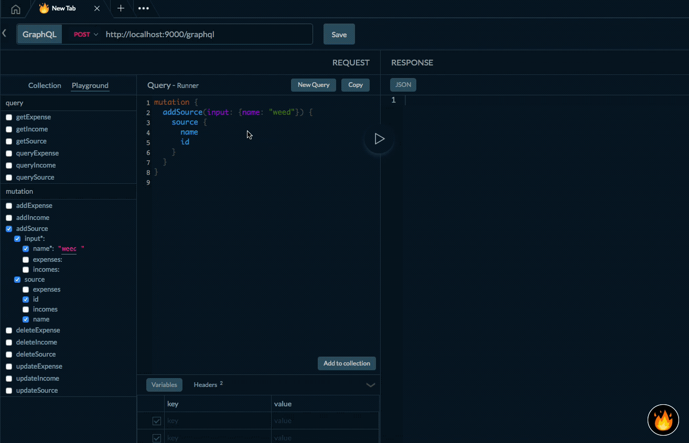

# GraphQL Editor Team - Dgraph Backend template

This template is worth 2020 ✨.

Brought by [GraphQL Editor Team](https://graphqleditor.com)

## Why?

You get database with graphql interface for storing your data just from GraphQL Schema. 

## How it works

Like that, and it is only from GraphQL Schema!! :



## Dependencies

[Docker](https://docs.docker.com/install/)

[jq](https://stedolan.github.io/jq/) 

These 2 are needed to run this

`npm`

## Quick Start

Clone this repo

```
git clone https://github.com/graphql-editor/graphql-backend-template-dgraph
```

```sh
npm install
```

To start with this template you will need GraphQL Schema. Create one with [GraphQL Editor](https://app.graphqleditor.com) and copy its contents to `schema.graphql` file. 
Example schema can look like this [Schema](https://app.graphqleditor.com/dgraph-testing/finance)
Remember when using Dgraph you need only Types, Interfaces and Enums. Also there is a small bug in Dgraph which doesnt allow comments in schema files.

Or if you are lazy:

Forget about the schema and use one inside repo. Do nothing and proceed.

Run this command in one terminal

```
npm run dgraph
```

And run this command in the other one

```
npm run inject-dgraph-schema
```

Voila. Your GraphQL native database is ready to use. Run queries in a tool like [Firecamp](https://firecamp.app), so Insomnia, GraphiQL etc.

## Generate Client libraries

When the server is running you can generate the actual dgraph generated schema file and autcomplete library for Javascript or TypeScript Frontend

### Browser / React Native

#### TypeScript
```
npm run generate-nodets
```

#### Javascript
```
npm run generate-nodejs
```


### Node

#### TypeScript
```
npm run generate-ts
```

#### Javascript
```
npm run generate-js
```

## Author

[Twitter](https://twitter.com/ACzemiel) - follow me for latest news with this boilerplate

[Github](https://github/aexol) - follow me for latest news with this boilerplate


## Under the hood

[Dgraph](https://dgraph.io/)

[Zeus](https://github.com/graphql-editor/graphql-zeus)

## Additional resuources

[Dgraph Definitions](https://app.graphqleditor.com/dgraph-testing/directives)
[Dgraph tutorial](https://blog.dgraph.io/post/building-native-graphql-database-dgraph/)